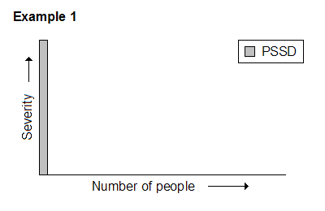
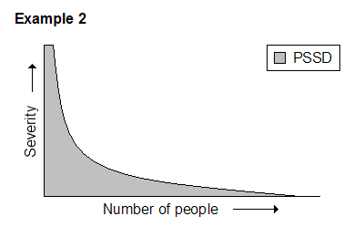

# [Quanto è comune la disfunzione sessuale post-SSRI (PSSD)?](https://rxisk.org/how-common-is-post-ssri-sexual-dysfunction-pssd/)

(Questa è la versione italiana dell’[articolo originale inglese](https://rxisk.org/how-common-is-post-ssri-sexual-dysfunction-pssd/ "How Common is Post-SSRI Sexual Dysfunction (PSSD)?"))

Il livello di rischio di sviluppare una disfunzione sessuale post-SSRI (PSSD) dall’uso di un antidepressivo SSRI o SNRI è attualmente **sconosciuto**. I pazienti non vengono _mai_ avvertiti dei persistenti effetti collaterali sessuali quando questi farmaci vengono prescritti.

Le richieste di consenso informato sono spesso accolte con la risposta che la PSSD sembra essere abbastanza rara. Dato l’enorme numero di antidepressivi prescritti ogni anno, il numero di _persone che lamentano_ (non che contraggono) la PSSD è relativamente piccolo. Normalmente non ci si aspetta che i medici discutano ogni raro effetto collaterale di un farmaco quando lo prescrivono.

Per i disinformati, questo potrebbe sembrare un argomento ragionevole. Tuttavia, ci sono una serie di dinamiche complesse coinvolte nella questione della PSSD che non solo rendono difficile stabilire la sua reale prevalenza, ma suggeriscono anche che la condizione potrebbe essere significativamente più comune di quanto generalmente si pensi.

## Ottenere una diagnosi

Una delle ragioni più ovvie per la sotto-diagnosi della PSSD è la mancanza di consapevolezza all’interno della comunità medica.

È difficile avere un quadro chiaro di come questo possa differire tra le varie specialità mediche, anche se c’è qualche suggerimento che gli urologi e quei medici specializzati in medicina sessuale sono di solito più familiari con la condizione, a volte commentando che hanno visto casi nei loro ambulatori di tanto in tanto. (Vedere [PSSD: ottenere una diagnosi](https://rxisk.org/post-ssri-sexual-dysfunction-getting-a-diagnosis/))

Mentre alcuni affetti da PSSD sono fortunati nei loro rapporti con il sistema sanitario, altri possono affrontare un’esperienza più difficile.

> Il fatto che gli antidepressivi siano stati originariamente prescritti può spesso rappresentare una barriera alla valutazione obiettiva e senza pregiudizi significativi di qualsiasi successivo disturbo di salute mentale. Questo non di rado fa sì che la PSSD venga completamente scartata come possibile causa. Fa anche parte di un problema più diffuso di medici che non si impegnano con i pazienti sul tema dei problemi legati al trattamento.

In alcuni casi, i sintomi appaiono solo quando l’antidepressivo viene effettivamente interrotto o la persona inizia a ridurre il dosaggio. Questo senza dubbio aggiunge un altro livello di difficoltà quando si cerca di ottenere una diagnosi. Vale la pena notare, tuttavia, che ciò corrisponde al profilo della discinesia tardiva indotta da antipsicotici, in cui il problema può svilupparsi sia durante l’assunzione del farmaco che quando si interrompe.

La necessità di lottare contro una comunità medica che non aiuta può rivelarsi troppo per alcuni malati di PSSD, in particolare se hanno anche a che fare con altri effetti collaterali come i problemi di astinenza.

> C’è anche la preoccupazione molto legittima che essere in disaccordo con i medici venga considerato come prova di un crescente disturbo di salute mentale e possa mettere a rischio la persona, o quanto meno influenzare il modo in cui viene percepita in qualsiasi consultazione futura a causa dei commenti nella cartella clinica.

Di fronte a queste difficoltà, alcuni semplicemente abbandonano il tentativo di ottenere assistenza per la loro condizione dal sistema sanitario, il che significa che _questi casi scompaiono_ dalla pratica clinica.

## Il valore di cercare aiuto

Per la maggior parte delle condizioni mediche, un paziente cerca l’assistenza della comunità medica perché spera di ricevere un trattamento efficace. Se si trova di fronte a un medico non utile, che non conosce la sua condizione o che non è disposto a impegnarsi, il paziente di solito persevera e porta avanti la questione. Potrebbe chiedere di vedere un altro medico per una seconda opinione o chiedere di vedere uno specialista. Potrebbe anche tentare di cercare e consultare esperti conosciuti a proprie spese.

Tuttavia, per certi versi, c’è molto meno valore nel perseguire questa linea d’azione in relazione alla PSSD. Chiunque faccia una ricerca nella letteratura pubblicata e nelle varie informazioni online si renderà presto conto che c’è poco che si possa fare per questa condizione. Non c’è una cura e attualmente non ci sono trattamenti praticabili. Anche con una diagnosi formale, alla fine c’è ben poco che un medico possa offrire. C’è quindi meno incentivo per chi soffre di PSSD a perseguire un intervento medico, soprattutto se incontra resistenza da parte del proprio medico.

## Apatia sessuale

Come parte della condizione, uomini e donne possono talvolta ritrovarsi con una riduzione o perdita della libido. Questo sembra produrre due risultati diversi in termini di reazione di chi ne soffre.

> Ci sono quelli che sono estremamente consapevoli di questo deterioramento e trovano l’esperienza molto sconcertante. La loro riduzione o mancanza di desiderio è anormale. Sanno che sono destinati ad essere attratti dalle persone e ad avere un desiderio per il sesso, eppure questi sentimenti sono stranamente assenti o attenuati. Insieme alle altre caratteristiche della PSSD, questo può produrre una situazione molto angosciante per chi ne è affetto.

Tuttavia, altri malati sono completamente _indifferenti_, anche quando sembrano riconoscere che si tratta di un effetto collaterale del farmaco. Essi scoprono che semplicemente non si preoccupano più del sesso e delle relazioni o le considerano abbastanza irrilevanti nella loro vita. Di conseguenza, anche qualsiasi difficoltà fisica che si accompagna che potrebbero avere diventa meno importante.

Alcuni malati notano che preferirebbero riavere queste capacità e sentimenti e poter ancora una volta perseguire le relazioni sessuali, ma sembra essere considerato semplicemente come qualcosa che sarebbe bello avere, invece di una preoccupazione pressante che sta causando una particolare angoscia.

> Questa apatia sessuale significa che queste persone sono meno propense a cercare assistenza medica, e questo comporta una ulteriore diminuzione dei casi segnalati.

## Quasi normale?

Mentre alcuni casi di PSSD comportano effetti collaterali sessuali che rimangono completamente invariati quando il farmaco viene interrotto, ci sono un certo numero di persone che trovano che la loro funzione sessuale è migliorata dopo aver interrotto l’SSRI, ma non è la stessa di prima. Alcuni di loro rimangono molto lontani dalla loro linea di base pre-medicinale e rientrano in un tipico caso di PSSD, ma altri sembrano tornare a ciò che potrebbe essere descritto vagamente come quasi normale.

> A differenza di alcuni dei casi più gravi, queste persone generalmente riferiscono di essere in grado di impegnarsi in attività sessuali normali o ragionevolmente normali, ma tuttavia qualcosa non è lo stesso. Possono avere meno interesse per il sesso o trovare più difficile eccitarsi. Gli orgasmi a volte sono più deboli. Si può avere la sensazione che il sesso non sia più quello di una volta – sembra mancare qualcosa di indefinibile.

Il fatto che la loro funzione sessuale abbia mostrato un miglioramento sostanziale quando l’antidepressivo è stato interrotto li porta a supporre che il farmaco non è più coinvolto, e che qualsiasi carenza rimanente deve essere dovuta a qualcos’altro, nonostante il fatto che avevano un funzionamento completamente normale immediatamente prima di iniziare il farmaco.

Anche coloro che negano qualsiasi effetto persistente e affermano che la loro funzione sessuale è tornata completamente alla normalità dopo aver smesso un antidepressivo, a volte ammettono che, riflettendoci, non è proprio la stessa cosa.

Alcuni di coloro che ne sono colpiti cercano di dare un senso a questo, assumendo che deve essere collegato ad altri aspetti della loro salute o ad altre cose che accadono nella loro vita. Possono anche non considerarsi come aventi una disfunzione sessuale significativa, solo un ridotto interesse o godimento del sesso. Quelli che hanno preso un antidepressivo per un po’ di tempo possono supporre che sia una parte normale della vita.

> Il punto importante è che queste persone generalmente non si lamentano del problema, e certamente non del farmaco. Spesso lo menzionano solo perché gli è stato specificamente chiesto. Anche quando la persona riconosce un legame con il farmaco, a volte è solo contenta che la sua funzione sessuale sia tornata nella misura in cui è tornata, e la considera un giusto compromesso per aiutare il suo problema di salute mentale. Se questo rappresenti un grado di apatia sessuale o semplicemente una visione pragmatica è difficile da sapere.

Chiunque riferisca al proprio medico che il sesso non sembra più buono come una volta, probabilmente troverà la conversazione indirizzata molto rapidamente verso l’umore, i problemi di relazione, ecc.

## Il quadro generale

Una rapida ricerca nella letteratura medica e nelle informazioni online sulla PSSD rivelerà casi di perdita completa della libido, profonda anestesia genitale, orgasmo senza piacere e incapacità di impegnarsi nell’attività sessuale.

Questi tipi di casi sono importanti. Descrivono le conseguenze potenzialmente devastanti della condizione e aiutano a definirne le caratteristiche.

Tuttavia, sta diventando sempre più chiaro che la condizione include una _vasta gamma di casi_, dai più gravi a quelli che notano che la loro funzione sessuale non è più la stessa di prima, e tutto ciò che sta in mezzo.

Negli sforzi per aumentare la consapevolezza è importante illustrare questa diversità all’interno della condizione, altrimenti c’è il rischio che la PSSD sia percepita solo come un effetto collaterale raro ed estremo, e quindi qualcosa che può essere troppo facilmente liquidato come irrilevante per la maggioranza delle persone.

> La prova di questa concezione errata può essere vista online. Alcune persone commentano che anche se hanno un certo grado di intorpidimento genitale persistente e orgasmi più deboli, sono in grado di fare sesso e “quindi” non hanno la PSSD. Altri hanno detto che la loro condizione è migliorata naturalmente nel tempo fino al punto in cui ora sono di nuovo in grado di fare sesso, e quindi sono “guariti” e non hanno più la PSSD, nonostante abbiano riferito che non c’è stato un ritorno al punto di partenza.

Qualsiasi compromissione del funzionamento sessuale o delle sensazioni di una persona che non riesce a tornare allo stato pre-farmaco dopo la sospensione di un antidepressivo appartiene saldamente alla conversazione sulla PSSD, indipendentemente dal livello in cui interferisce con la capacità di impegnarsi in una normale attività sessuale.

> Lungi dal diluire la gravità della condizione, questo in realtà porta in vista la possibilità molto reale che gli effetti collaterali sessuali persistenti possono essere più comuni di quanto si pensi, e che molti di questi casi possono passare sotto il radar.

## Sensazione: un effetto collaterale mancante

Uno studio pubblicato nel 1999 ha esaminato l’efficacia della fluoxetina come possibile trattamento dell’eiaculazione precoce \[1\]. Ha trovato che l’antidepressivo aumentava il tempo necessario all’eiaculazione ed era quindi considerato utile.

Il punto interessante è che oltre a misurare il tempo all’eiaculazione, un certo numero di parametri aggiuntivi sono stati valutati utilizzando test neurofisiologici. Uno di questi era la soglia sensoriale del pene. Gli elettrodi sono stati posizionati sul pene del soggetto e sono state generate correnti elettriche molto piccole fino a quando il soggetto poteva sentire la sensazione. La corrente veniva poi diminuita fino a quando non poteva più essere percepita. Questo secondo dato è stato preso come misura della **sensibilità del pene**.

Questo test è stato effettuato sia sul gruppo di studio (fluoxetina) che sul gruppo di controllo (placebo), sia prima che alla fine del periodo di trattamento di un mese.

> Alla fine dello studio, si è scoperto che la fluoxetina aveva aumentato la soglia sensoriale del pene di quasi il 25% rispetto al placebo che è rimasto lo stesso del pre-trattamento. In altre parole, si è scoperto che la fluoxetina ha ridotto la sensazione del pene. Lo studio ha concluso che questa riduzione della sensazione era probabilmente responsabile dell’aumento del tempo all’eiaculazione.

Uno studio precedente del 1990 ha trovato che l’antidepressivo triciclico, la clomipramina, ha anche causato un aumento della soglia sensoriale del pene \[2\]. Vale la pena notare che mentre la clomipramina è classificata come un antidepressivo triciclico, è anche un inibitore della ricaptazione della serotonina.

Oltre a questi studi, dal 1991 sono apparsi in letteratura casi pubblicati di _intorpidimento genitale_ durante l’assunzione di un SSRI, compreso un rapporto di anestesia dei capezzoli nel 2000 \[3-9\]. Questo senza includere i casi di anestesia genitale dalla letteratura sulla PSSD.

Niente di tutto ciò è sorprendente, poiché _la ridotta sensibilità genitale è un effetto collaterale noto e comune degli antidepressivi SSRI_. Se ci fanno caso, la maggior parte delle persone che prendono un SSRI noteranno un certo grado di riduzione della sensibilità genitale entro 30 minuti dall’assunzione della prima dose.

Tuttavia, una ricerca nei foglietti informativi dei farmaci e nei siti web sulla salute troverà pochissime menzioni a riguardo. Invece, le informazioni che dominano il dominio pubblico si concentrano sugli effetti collaterali come la libido, i problemi di erezione/lubrificazione e la difficoltà ad avere un orgasmo.

Se doveste chiedere al vostro medico se gli SSRI possono ridurre la sensazione genitale, probabilmente ricevereste uno sguardo strano e vi verrebbe detto che gli SSRI non lo fanno.

La maggior parte delle persone sembra essere consapevole del fatto che gli antidepressivi possono influenzare l’eccitazione e rendere più difficile avere un orgasmo, ma il fatto che possano ridurre la sensazione genitale (e le sensazioni sessuali più in generale, ad esempio la riduzione della sensazione di piacere durante l’orgasmo) non sembra essere nella coscienza pubblica. Manca completamente nel dialogo generale sugli effetti collaterali degli antidepressivi.

### Studi successivi sull’eiaculazione precoce

Nel 2006-07, sono stati pubblicati tre grandi studi randomizzati e controllati con placebo che hanno esaminato l’efficacia di citalopram, sertralina ed escitalopram per l’eiaculazione precoce \[10-12\]. Questi sono tutti SSRI.

A differenza degli studi precedenti citati, non hanno testato la soglia sensoriale del pene. Tuttavia, hanno incluso qualcosa che gli studi precedenti non hanno fatto: un follow-up di 3 e 6 mesi.

> Si è scoperto che l’effetto di ritardare l’eiaculazione degli SSRI era continuato per un numero significativo di partecipanti, diversi mesi dopo che i farmaci erano stati sospesi.

Un’analisi dei risultati degli studi su citalopram e sertralina e del loro significato in relazione alla PSSD è stata precedentemente discussa in letteratura \[13\]. Di particolare rilievo è il fatto che i partecipanti allo studio non avevano alcun disturbo mentale preesistente su cui l’effetto persistente potesse essere attribuito.

Ma potrebbe esserci un altro punto importante.

Lo studio sulla fluoxetina del 1999 ha concluso, sulla base dei suoi test neurofisiologici, che la capacità del farmaco di ritardare l’eiaculazione era probabilmente dovuta al suo effetto di aumentare la soglia sensoriale del pene. Ha anche notato i risultati dello studio del 1990 in cui la clomipramina ha avuto lo stesso effetto.

> Se questa conclusione è corretta e viene applicata ai tre grandi studi del 2006-07, allora significa che oltre a mostrare un effetto persistente dell’eiaculazione ritardata, questi studi sono anche potenzialmente la prova di una riduzione persistente della sensazione genitale in un numero significativo di partecipanti dopo l’interruzione di tre diversi SSRI.

## Mettere insieme i pezzi

Una visione comune del PSSD è che si tratta di una condizione grave che una persona sviluppa o meno – e che la grande maggioranza delle persone non lo fa. Pertanto, la prevalenza viene generalmente assunta come qualcosa di simile all’esempio 1:

Tuttavia, questa idea sembra sempre meno convincente. Tenendo conto di tutto, si presenta la possibilità che il vero quadro possa assomigliare di più all’esempio 2 o a qualche sua variante:

La domanda originale era: quanto è comune la disfunzione sessuale post-SSRI? Questo articolo potrebbe non aver fornito una risposta, ma forse suggerisce una serie di ragioni per cui alcuni pazienti potrebbero non identificarsi con la condizione, nonostante il persistere di effetti collaterali sessuali.

> Gli SSRI e gli SNRI possono avere effetti sessuali molto complessi e possono produrre cambiamenti che alcuni malati possono trovare difficile da capire, in particolare quando si tratta di sensazioni alterate e sentimenti sessuali smorzati. A seconda del livello di gravità, alcune persone possono sentire che le gravi disfunzioni spesso associate alla PSSD non corrispondono a ciò che stanno vivendo.

Forse la vera domanda è:

**Chiunque prenda un SSRI o un SNRI riacquista effettivamente il 100% della sua funzione sessuale originale e delle sensazioni, o rimane quasi sempre con un certo grado di alterazione a lungo termine?**

## Bibliografia

\[1\] Yilmaz U, Tatlişen A, Turan H, Arman F, Ekmekçioğlu O. [The effects of fluoxetine on several neurophysiological variables in patients with premature ejaculation](https://www.ncbi.nlm.nih.gov/pubmed/10037380). J Urol. 1999 Jan;161(1):107-11. PMID 10037380.

\[2\] Colpi GM, Fanciullacci F, Aydos K, Grugnetti C. [Effectiveness mechanism of chlomipramine by neurophysiological tests in subjects with true premature ejaculation](https://www.ncbi.nlm.nih.gov/pubmed/1897755). Andrologia. 1991 Jan-Feb;23(1):45-7. PMID 1897755.

\[3\] Neill JR. [Penile anesthesia associated with fluoxetine use](https://www.ncbi.nlm.nih.gov/pubmed/1928483). Am J Psychiatry. 1991;148:1603. PMID 1928483.

\[4\] Measom MO. [Penile anaesthesia and fluoxetine](https://www.ncbi.nlm.nih.gov/pubmed/1575264). Am J Psychiatry. 1992;149:709. PMID 1575264.

\[5\] King VL, Jr, Horowitz IR. [Vaginal anesthesia associated with fluoxetine use](https://www.ncbi.nlm.nih.gov/pubmed/8494083). Am J Psychiatry. 1993;150:984–5. PMID 8494083.

\[6\] Ellison JM, DeLuca P. [Fluoxetine-induced genital anesthesia relieved by Ginkgo biloba extract](https://www.ncbi.nlm.nih.gov/pubmed/9590676). J Clin Psychiatry. 1998;59:199–200. PMID 9590676.

\[7\] Diesenhammer EA, Trawoger R. [Penile anesthesia associated with sertraline use](https://www.ncbi.nlm.nih.gov/pubmed/10665639). J Clin Psychiatry. 1999;60:869–70. PMID 10665639.

\[8\] Michael A, Mayer C. [Fluoxetine-induced anaesthesia of vagina and nipples](https://www.ncbi.nlm.nih.gov/pubmed/10755087). Br J Psychiatry. 2000;176:299. PMID 10755087.

\[9\] Michael A, Andrews S. [Paroxetine-induced vaginal anaesthesia](https://www.ncbi.nlm.nih.gov/pubmed/12163985). Pharmacopsychiatry. 2002;35:150–1. PMID 12163985.

\[10\] Safarinejad MR, Hosseini SY (2006). [Safety and efficacy of citalopram in the treatment of premature ejaculation: a double-blind placebo-controlled, fixed dose, randomized study](https://www.ncbi.nlm.nih.gov/pubmed/16107866). Int J Impot Res. 18: 164–9. PMID 16107866.

\[11\] Arafa M, Shamloul R (2006). [Efficacy of sertraline hydrochloride in treatment of premature ejaculation: a placebo-controlled study using a validated questionnaire](https://www.ncbi.nlm.nih.gov/pubmed/16554853). Int J Impot Res. 18 (6): 534–8. PMID 16554853.

\[12\] Safarinejad MR (October 2007). [Safety and efficacy of escitalopram in the treatment of premature ejaculation: a double-blind, placebo-controlled, fixed-dose, randomized study](https://www.ncbi.nlm.nih.gov/pubmed/17873675). J Clin Psychopharmacol 27 (5): 444–50. PMID 17873675.

\[13\] Bahrick AS. [Persistence of sexual dysfunction side effects after discontinuation of antidepressant medications: Emerging evidence](http://benthamopen.com/ABSTRACT/TOPSYJ-1-42). The Open Psychology Journal. 2008;1:42-50. doi:10.2174/1874350100801010042.
