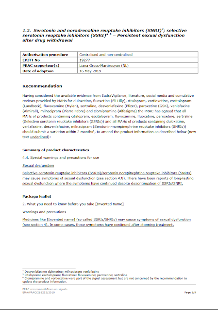

### Nuova raccomandazione EMA sulle disfunzioni sessuali persistenti da SSRI ed SNRI

Data: 11 Giugno 2019

L’11 Giugno 2019 viene pubblicata la nuova Raccomandazione dell’EMA per i farmaci SSRI ed SNRI, decisa nel PRAC meeting del 16 maggio 2019 ([vedi Agenda](https://www.ema.europa.eu/documents/agenda/agenda-prac-draft-agenda-meeting-13-16-may-2019_en.pdf)):
entro 2 mesi i produttori dovranno aggiornare i foglietti informativi con la dicitura che le disfunzioni sessuali in alcuni casi persistono dopo la sosospensione.

Raccomandazione:

* Inglese [https://www.ema.europa.eu/documents/prac-recommendation/prac-recommendations-signals-adopted-13-16-may-2019-prac-meeting_en.pdf](https://www.ema.europa.eu/documents/prac-recommendation/prac-recommendations-signals-adopted-13-16-may-2019-prac-meeting_en.pdf "https://www.ema.europa.eu/documents/prac-recommendation/prac-recommendations-signals-adopted-13-16-may-2019-prac-meeting_en.pdf")
* Italiano [https://www.ema.europa.eu/en/documents/other/new-product-information-wording-extracts-prac-recommendations-signals-adopted-13-16-may-2019-prac_it.pdf](https://www.ema.europa.eu/en/documents/other/new-product-information-wording-extracts-prac-recommendations-signals-adopted-13-16-may-2019-prac_it.pdf "https://www.ema.europa.eu/en/documents/other/new-product-information-wording-extracts-prac-recommendations-signals-adopted-13-16-may-2019-prac_it.pdf")

