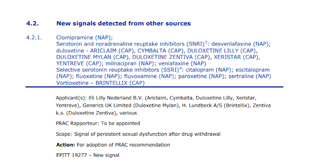
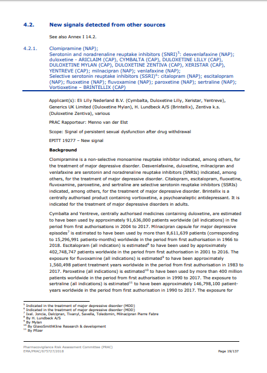
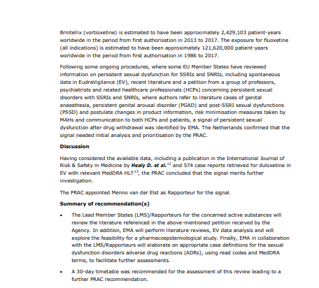

L’Agenzia Europea per i Medicinali (EMA) esamina il problema della PSSD

Nell’ambito della seduta PRAC (Pharmacovigilance Risk Assessment Committee) del 3-6 settembre 2018, l’**Agenzia Europea per i Medicinali** (EMA – European Medicines Agency) ha affrontato una discussione preliminare sul problema della Disfunzione sessuale post-SSRI/SNRI.

A questo link è consultabile l’Agenda col programma del meeting PRAC 3-6 settembre 2018 (pagina 16):  
[https://www.ema.europa.eu/documents/agenda/agenda-prac-draft-agenda-meeting-3-6-septembe](https://www.ema.europa.eu/documents/agenda/agenda-prac-draft-agenda-meeting-3-6-september-2018_en.pdf "https://www.ema.europa.eu/documents/agenda/agenda-prac-draft-agenda-meeting-3-6-september-2018_en.pdf")[Download File]( "Download File")[r-2018_en.pdf](https://www.ema.europa.eu/documents/agenda/agenda-prac-draft-agenda-meeting-3-6-september-2018_en.pdf "https://www.ema.europa.eu/documents/agenda/agenda-prac-draft-agenda-meeting-3-6-september-2018_en.pdf")

\*_Il 26 ottobre 2018 viene pubblicato il verbale della riunione, consultabile a questo link (pagine 19 e 20):  
\*_[**https://www.ema.europa.eu/documents/minutes/minutes-prac-meeting-3-6-september-2018_en.pdf**](https://www.ema.europa.eu/documents/minutes/minutes-prac-meeting-3-6-september-2018_en.pdf "https://www.ema.europa.eu/documents/minutes/minutes-prac-meeting-3-6-september-2018_en.pdf")

