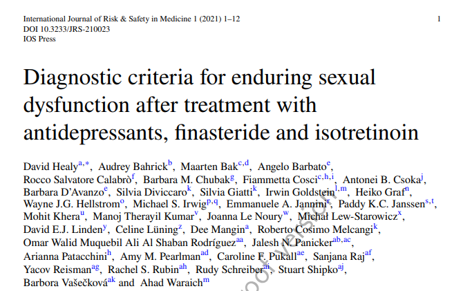

# **Criteri diagnostici per la disfunzione sessuale persistente dopo il trattamento con antidepressivi, finasteride e isotretinoina**

Grazie allo sforzo di un gruppo interdisciplinare di 37 esperti sono stati pubblicati i [“Diagnostic criteria for enduring sexual dysfunction after treatment with antidepressants, finasteride and isotretinoin”](https://content.iospress.com/articles/international-journal-of-risk-and-safety-in-medicine/jrs210023#ref013 "The paper").

Potete vedere e scaricare la versione pre-stampa al link qui sopra. Ci sono alcuni piccoli errori di formattazione da parte dell’editore che si spera saranno corretti nella versione stampata quando uscirà, ma l’articolo è già perfettamente leggibile.

Qui c’è la nostra traduzione in italiano dell’articolo integrale: [Criteri diagnostici per la disfunzione sessuale persistente dopo il trattamento con antidepressivi, finasteride e isotretinoina](https://postssrisyndrome.org/la-sindrome/criteri-diagnostici/ "Apri la pagina della traduzione in italiano del paper")

L’articolo chiarisce molti punti fondamentali, spesso fonte di fraintendimento (differenziazione quantitativa e qualitativa dei sintomi, studi su volontari sani, rischi di misdiagnosi con potenziali ulteriori danni), e fornisce criteri diagnostici per:

* disfunzione sessuale post-SSRI (PSSD)
* disturbo persistente dell’eccitazione genitale (PGAD) in seguito agli inibitori della ricaptazione della serotonina
* sindrome post-finasteride (PFS)
* disfunzione sessuale post-retinoide (PRSD)

Scrivere l’articolo, farlo pubblicare ed essere in grado di renderlo liberamente disponibile ha richiesto molto lavoro.

La rivista normalmente fa pagare $27.50 USD per accedere all’articolo completo, a meno di non essere abbonati. Un’altra opzione è quella di pagare 1250 € per l’accesso aperto. Molti autori dello studio hanno deciso di contribuire per rendere l’accesso aperto (il resto è stato coperto da RxISK), quindi adesso chiunque può accedere al full-text e scaricare il PDF dell’articolo.

Un grande ringraziamento a tutti gli autori da parte nostra.

Sentitevi liberi di condividere il documento con chiunque possa essere interessato.

L’articolo su RxISK: [https://rxisk.org/diagnostic-criteria-for-enduring-sexual-dysfunction/](https://rxisk.org/diagnostic-criteria-for-enduring-sexual-dysfunction/ "https://rxisk.org/diagnostic-criteria-for-enduring-sexual-dysfunction/")